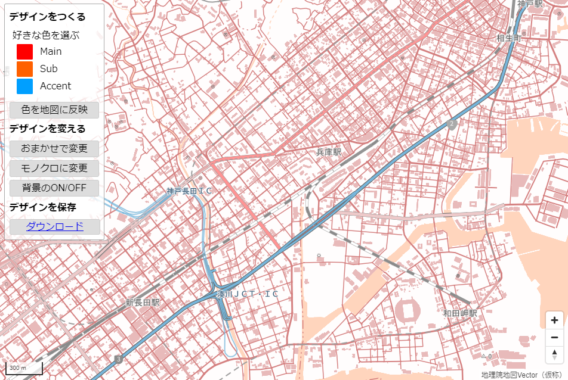

# ベクトルタイルカラーデザイン変更ツール

## 本レポジトリについて

本レポジトリでは、地理院地図Vector（仮称）（ https://maps.gsi.go.jp/vector/ ）で提供している地図データ（ベクトルタイル）の活用例として、
**簡単な操作で様々なカラーデザインの地図を表示することができるツール**を提供しております。

ツールのURL  https://gsi-cyberjapan.github.io/gsivectortile-color-design/tool.html

地理院地図Vectorの地図データは、出典を明示いただければ、ご自分のサイトやアプリ等でもご利用いただけます。
本ツールでは、地図のカラーデザインの設定ファイル（いわゆるstyle.json）をダウンロードすることもできますので、オリジナルのサイトやアプリ等を構築する際の参考にしていただけます。

たとえば、サイトのイメージカラーに合わせた地図デザインを作ったり、カラーユニバーサルデザインを考慮した地図を考えるヒントにしたりする等の活用が考えられます。




本ツールで地図のカラーデザインを変更した例


## 使い方

### デザインをつくる
Main（メインカラー）、Sub（サブカラー）、Accent（アクセントカラー）の3色を指定して、「色を地図に反映」ボタンを押すと、
指定した3色を使って、地図全体のカラーデザインを変更します。
色を指定する際は、カラーピッカー内の「Save」ボタンを押すのを忘れないでください。

アクセントカラーは主に高速道路や注記の一部、サブカラーは水域や海岸線等に利用されます。
※地図記号の色は変更されません。


### デザインを変える

#### 「おまかせで変更」

表示されている地図のカラーデザインを自動で変更します。

#### 「モノクロに変更」

表示されている地図をモノクロのカラーデザインにします。

#### 「背景のON/OFF」

背景色の表示・非表示を変更できます。背景色は、非表示中でも他のボタン操作で変更されます。
また、背景色は、ズームレベル8～16では、薄めに設定されています。


### デザインを保存（技術者向け）

変更したデザインの設定ファイル（style.json）は「ダウンロード」ボタンから保存できます。
この設定ファイルは[Style Specification](https://docs.mapbox.com/mapbox-gl-js/style-spec/)に準拠しており、
Style Specification に対応した地図表示ソフトウェア・ライブラリ（たとえば、Mapbox GL JS）などで、利用することができます。

※地理院地図Vectorでは利用できませんので、ご了承ください。

本ツールや、本ツールで作成したスタイル設定ファイルを利用して、地理院地図Vectorの地図データを表示するサイトを構築した場合には、構築したサイトに出典の記載をお願いします。

出典の記載例：`<a href=”https://maps.gsi.go.jp/vector/” target=”blank”>地理院地図Vector（仮称）</a>`

また、Mapbox GL JSを利用した地理院地図Vectorの地図データの表示方法については、以下のレポジトリを参考にしていただけます。

[Mapbox GL JSで地理院地図Vector風の地図を表示するサンプル](https://github.com/gsi-cyberjapan/gsivectortile-mapbox-gl-js)


## 表示される地図データについて

本ツールやダウンロードしたスタイル設定ファイルを利用して表示される地図データはベクトルタイルとなっております。
このデータのURLは以下の通りです。

```https://cyberjapandata.gsi.go.jp/xyz/experimental_bvmap/{z}/{x}/{y}.pbf```

このベクトルタイルの詳細については、以下のレポジトリをご覧ください。

[地理院地図Vector（仮称）提供実験](https://github.com/gsi-cyberjapan/gsimaps-vector-experiment)


## 地理院地図Vectorとの相違点

本ツールで表示したり、ダウンロードしたりできるスタイル設定ファイル（style.json）は、[Style Specification](https://docs.mapbox.com/mapbox-gl-js/style-spec/)に準拠したものとなります。
一方、地理院地図Vectorのstyle.jsonでは、Style Specificationをベースに、若干の拡張を施しています。そのため、地理院地図Vectorとは、地図の表示が異なる部分がございます。

地図の表示が異なる部分の例
* 建物等のハッチング表現は行わず、全て塗りつぶしで表現しております。
* 注記は、すべて横書きとなっております。そのため、本来の注記位置とのずれ等、表示に不具合があることがあります。


## 本ツールに利用したライブラリ・参考文献

### ライブラリ
* Mapbox GL JS ( https://github.com/mapbox/mapbox-gl-js )
* Pickr ( https://github.com/Simonwep/pickr )

### 参考文献
* 元永佳孝, 亀岡孝治, 橋本篤 (1997):農産物表面色の色彩画像処理システムの構築, 農業機械学会誌, 59, 13-21.


## 注意事項

本ツールは実験的に提供しているものです。動作保証は行っておりません。

また、予告なく変更・削除する可能性があります。

本ツールの利用により生じた損失及び損害等について、国土地理院はいかなる責任も負わないものとします。


